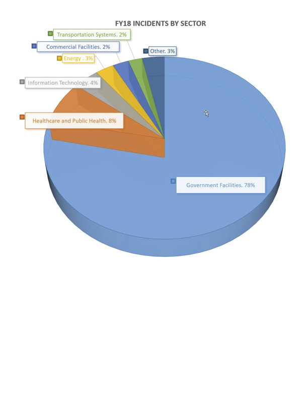

# Differences in Deployments in ICS

## What is an ICS?

ICS refers to the facilities, systems, and equipment that comprise the operational real-time control environment, services, diagnostics, and functional capbilities necessary for the effective and reliable operation of automation systems. 

ICS - devices or set of devices that manage the behavior of other devices.

An ICS system is an interconnection of components related in such a mannner as to command, direct, or regulate itself or another system. 

Examples include:

- A batch mixing process contained in a chemical plant

- Tracking and coordination of train movement over a busy rail system.

## Types of ICS?

**Supervisory Control and Data Acquisition System (SCADA)**

- A large scale, distributed measurement and control system. SCADA systems are used in the transmission and distribution of oil, gas, water, and electricity.

**Distributed Control System (DCS)**

- A system where control is achieved by the distribution of live data (intelligence) throughout the controlled system, rather than from a centrally located single unit. DCS are used in power generation, chemical processing, oil refining, and wastewater treatment.

**Process Control System (PCS)**

- A general term that encompasses several types of control systems used in industrial production, including SCADA, DCS, and other smaller control system configurations such as programmable logic controllers (PLC). PCS are used in water treatment, chemical processing, mining, pharmaceuticals, and manufacturing.

**Energy Management System (EMS)**

- A system of computer-aided tools used by operators of electric utility grids to monitor, control, and optimize the performance of the generation and/or transmission system. EMS are used in electrical energy and pump optimization.

**Automation System (AS)**

- A technology concerned with performing a process by means of programmed commands combined with automatic ffeedback control to ensure proper execution of the instructions. The resulting system is capable of operating without human intervention. AS are used in material handling and discrete manufacturing.

**Safety Instrumented System (SIS)**

- An engineered set of hardware and software controls commonly used on critical process safety systems. SIS are especially useful in safety shutdown and equipment protection systems.

**Other Automated Control Systems**

- An example of another automated control system is a building automation system (BAS), such as automatic doors, or controls for heating, ventilation, and air conditioning (HVAC)

## What are Uses of ICS?

Examples of processes - Purifying water, landing airplanes, and distilling chemicals. 

ICS have components that are common to controlling processes, even if the processes are different. 

Because of differences within process environments, there will also be differences in ICS implementations.

**Example**

One process may be designed to shut off the product flow into a vessel based on the level the product has reached, while another process uses the product weight or a calculation of volumetric flow as a control. 

## ICS and Cybersecurity

Initially, physical security was the primary concern due to a safety perspective, rather than a system protection concern. 

Cybersecurity was not considered a problem because ICS were not interconnected and were located within trusted environments. 

As products became more sophisticated with regards to IT functionality - remote access or interconnectivity with standards-based networks, vulnerabilities were introduced. 

# The Changing Security Landscape

## Magnitude of the Problem

<a href = "https://www.cisa.gov/">The Department of Homeland Security (DHS) Cybersecurity and Infrastructure Security Agency (CISA) Industrial Control Systems Computer Emergency Readiness Team (US-CERT)</a> received and responded to 2,119 incidents as reported by asset owners and industry partners in FY18. 

The scope of incidents encompassed a vast range of threats and observed methods for attempting to gain access to both business and control system infrastructure.

## Examples of the problem

### Oldsmar Water Treatment Plant

The plant was utilizing Team Viewer for remote access and assistance, which was consistenly running. An attacker exploited this and accessed the system.

The hacker increased the amount of sodium hydroxide setting from 100 parts-per-million (ppm) to about 11,100 ppm.

### Colonial Pipeline

In May 2021, Colonial Pipeline experienced a ransomware attack. Hackers entered the system via an unused but active VPN account. The hackers stole 100 GB of data and installed ransomware.

To stop the spread, the entire pipeline system was shut down 70 minutes after the initially discovery. The pipeline delivered 2.5 million gallons of fuel per day to the southeast states. 

### Stuxnet

It was the first known malware to specifically target a control system. It is believed to be have been introduced by a USB stick.

Stuxnet modifies programs for a specific PLC, hides the changes, and employs sophisticated evasion techniques. It only impacts ICS operating variable frequency drives.

## Stay Informed

<a href = "https://www.cybersecurityintelligence.com/repository-of-industrial-security-incidents-risi-3024.html"> The Repository of Industrial Security Incidents (RISI) </a>
is a database of open-source and anonymously reported ICS incidents. 

<a href = "https://nvd.nist.gov/"> National Vulnerability Database </a>

# Critical Infrastructure and Key Resource Sectors

**What are critical infrastructure and key resource sectors (CIKR)?**

The 16 critical infrastructure and key resource (CIKR) sectors are considered vital to the safety, security, and economic viability of the country. Many of the CIKR sectors are related directly to the health and well-being of citizens, such as energy, water, and transportation.

## CIKR Interdependencies

A failure in one sector could cause a significant impact on other sectors. 

Example: An ICS failure in the Energy sector resulting in electrical blackouts will likely affect other CIKR sectors that depend on electrical power.

## What are the Types of facilities that support critical infrastructure?

**Site** 

The process and discrete manufacturing industries produce products at site facilities. A site facility is usually physically protected within a fence or other enclosure. 

**Transmission Facilities**

These facilities can span counties, states, or countries. They are the transmission lines or pipelines that carry electricity, oil, and water over long distances. 

- Includes railroads and highways that trains and trucks use to carry goods. 
- Usually unmanned
- Most transmission infrastructure, such as pumps and compressor stations,are in in remote locations, which are difficult to secure.

**Generation Facilities**

Produce genergy and consists of electric generators and auxiliary equipment for converting mechanical, chemical, hydro, wind, solar, or  nuclear energy into electric energy. 

**Distribution facilities**

Used to distribute products to the customers. They provide infrastructure to deliver electricity, water, and natural gas. 

Distribution facilities may be monitored and controlled from a central control center, or may be standalone systems. 

**Electric Grid**

A network of synchronized power providers and customers, connected by transmission and distribution lines, and operated by one or more control centers.

# Identify different types of industrial processes and their dependencies

## Types of manufacturing

**Discrete manufacturing** results in the creation of products that can be easily differentiated - cars, books, toys, furniture, or cell phones. Discrete manufacturing is not continuous, meaning it can be started or stopped at any time. 

**Process manufacturing** involves using formulas. Examples include oil refining, chemical refining, food and beverage production, and pulp and paper production. It differs from discrete manufacturing because once the final product is produced, it cannot be taken apart to get the original components.

**Continuous process manufacturing**

- Uninterrupted flow of material from start to finish during the transition from a raw material to finished product.

- The ICS used in continuous processes must be flexible to control all phases of the process: from startup to shutdowns, to maintenance shutdowns. During continuous operations, such as in a refinery, the ICS is constantly adjusting the valves and pumps to keep the process within specifications.

**Batch process**

- Has a starting and ending point. As one phase of the batch is finished, the system will transition to another phase of the batch process. 

- Pharmaceuticals and specialty chemicals rely heavily on batch automation to create their products. 

- Batch management systems work with the control system to execute batch processes. They are also used to manage recipes and records. 

**Hybrid process**

- Uses a combination of continuous and batch controls. 

- Water treatement is a good example of a hybrid process. Water flows through the treatment plant where disinfectants are injected into the water to kill bacteria. The chemicals cause particles to clump together, where they are removed through sedimentation or filtration.

## Process Dependencies

A process relies on upstream and downstream systems to produce a product. These interdependencies create both cyber and physical security concerns. 

Most process and discrete manufacturing facilities have a control system that monitors and controls the main process. 

